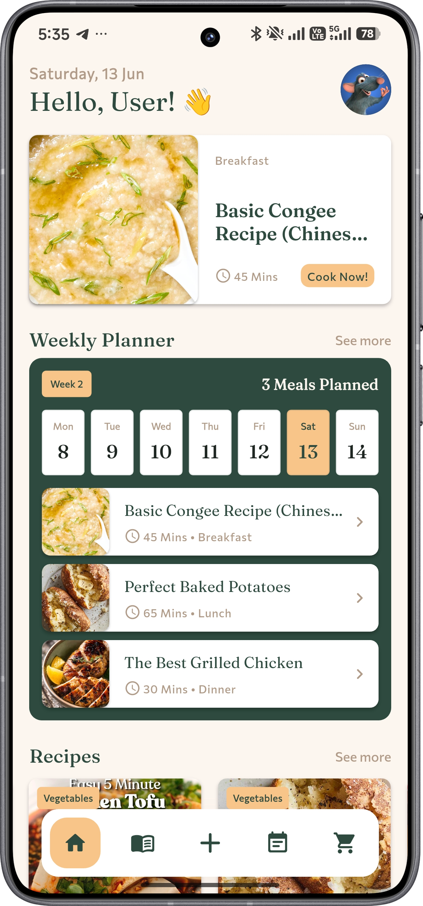
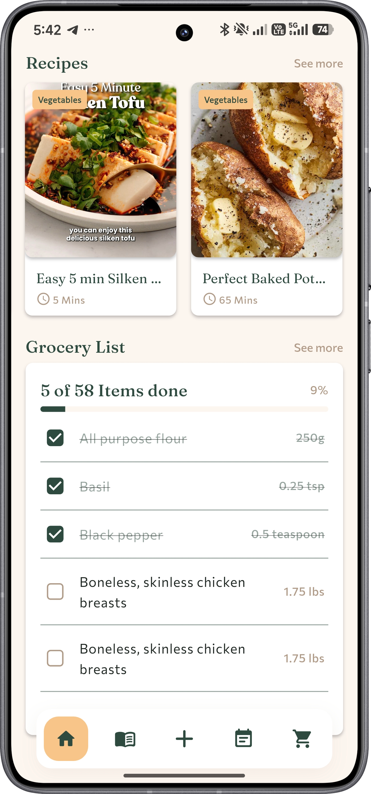
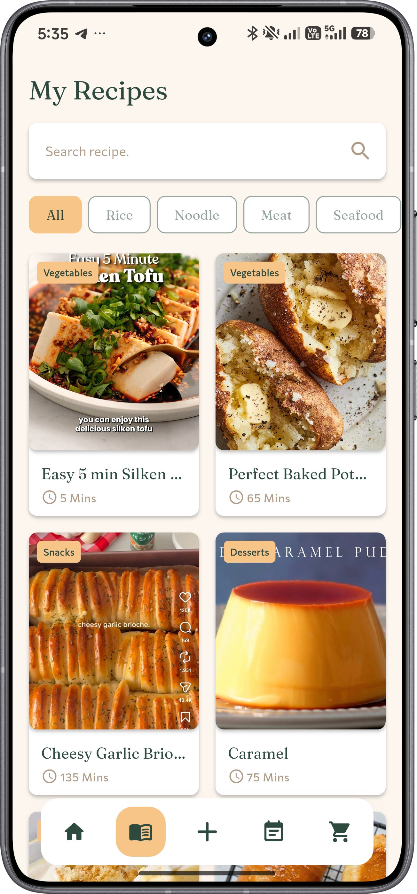
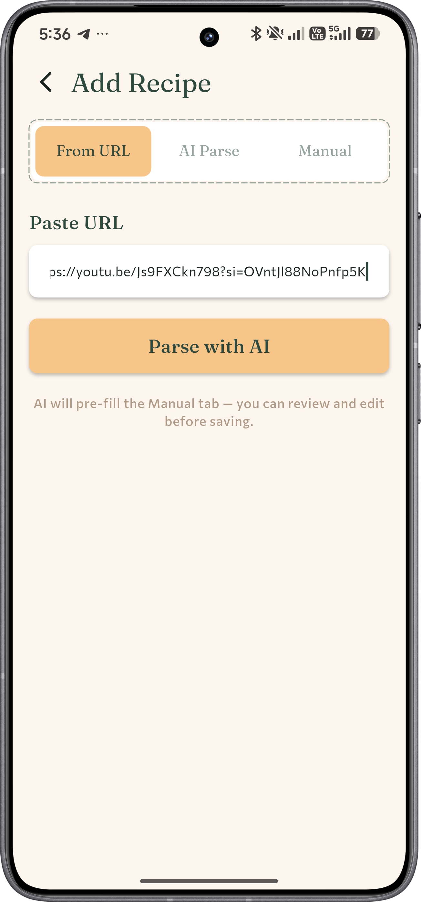
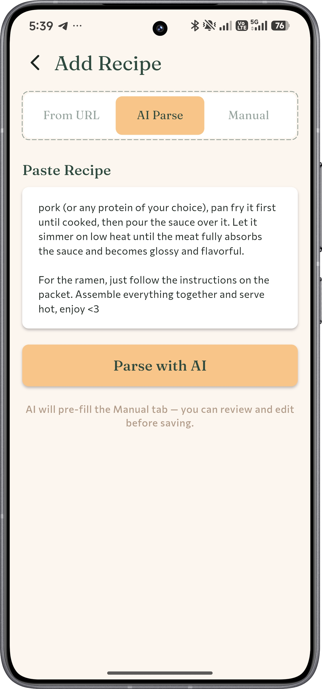
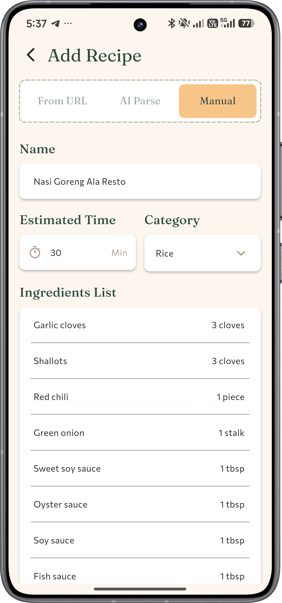
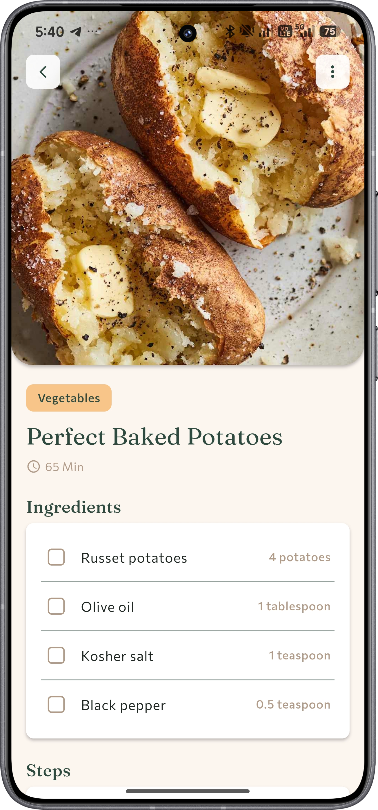
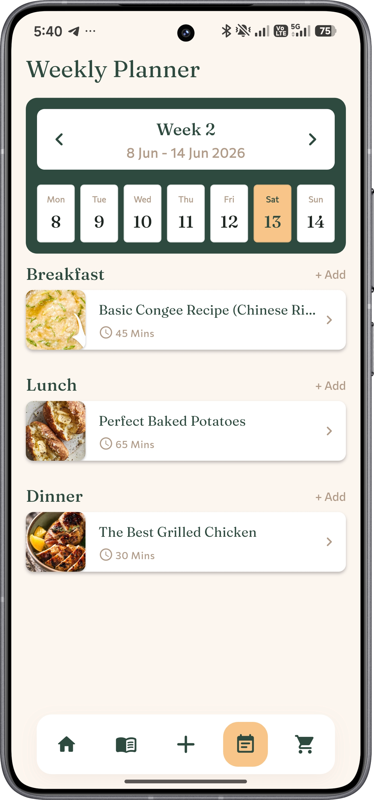
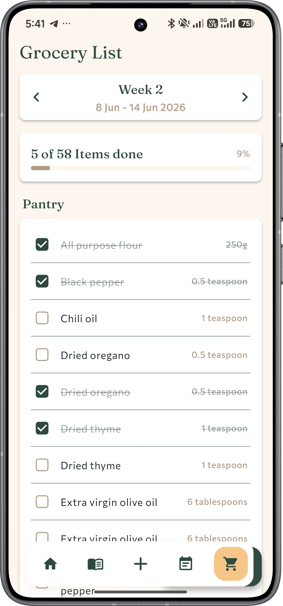

**Your personal recipe collection book. Save recipes from anywhere, plan your meals, and shop smarter.**

Ever find an amazing recipe on Instagram, TikTok, or YouTube, send it to your DMs, like the post, save it, and then never open it again?

Same. That's why I built **Nyom**.

Nyom is a personal recipe collection app that makes it stupid-easy to save, organize, and actually *use* the recipes you find while scrolling. Paste a link, drop in a caption, or type it in yourself. Nyom handles the rest with AI, turning messy social media content into clean, structured recipes you can actually cook from.

---

## 📸 Screenshots

| Home | Home Scrolled | Recipe Collection |
|------|---------------|-------------------|
|  |  |  |

| Add Recipes - URL | Add Recipes - Text | Add Recipes - Manual |
|-------------------|--------------------|----------------------|
|  |  |  |

| Recipe Detail | Meal Planner | Grocery List |
|---------------|--------------|--------------|
|  |  |  |

## ✨ Features

### 🤖 AI Recipe Parsing
Nyom can parse recipes in 3 ways:

- **🔗 From a URL**: Paste a YouTube video link or article URL and Nyom extracts the recipe automatically.
  > ⚠️ Note: Direct links to TikTok and Instagram don't work due to their in-app restrictions and Gemini API limitations. Use the text/caption method for those instead.
- **📝 From Text / Caption**: Copy-paste any Instagram caption, YouTube description, or any recipe text and Nyom's AI will parse it into a clean structured recipe.
- **✏️ Manual Input**: Have your own recipe? Just type it in yourself.

### 📅 Meal Planner
Plan your entire week ahead. Assign recipes to specific days and meal slots, and always know what's on the menu.

### 🛒 Grocery List
Automatically generated from your meal plan. No more trying to remember what you need. Nyom collects all the ingredients, categorizes them, and tracks what you've already picked up.

## 🛠️ Tech Stack

| Layer | Technology |
|-------|-----------|
| **Frontend** | Flutter (Dart) |
| **Backend & Database** | Supabase (Auth, PostgreSQL, Edge Functions) |
| **AI Parsing** | Google Gemini API (via Supabase Edge Functions) |

## 📲 Download

Grab the latest APK from the [Releases](https://github.com/mnbvcxzz4869/nyom_recipe_app/releases) page.
